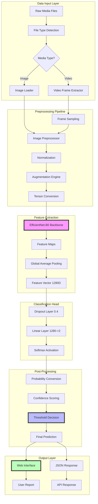
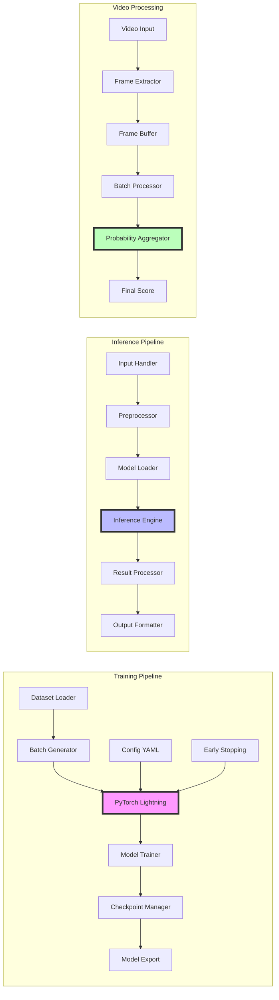
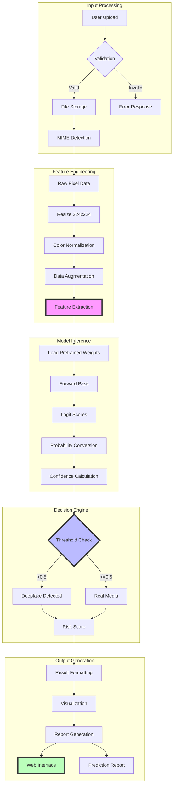
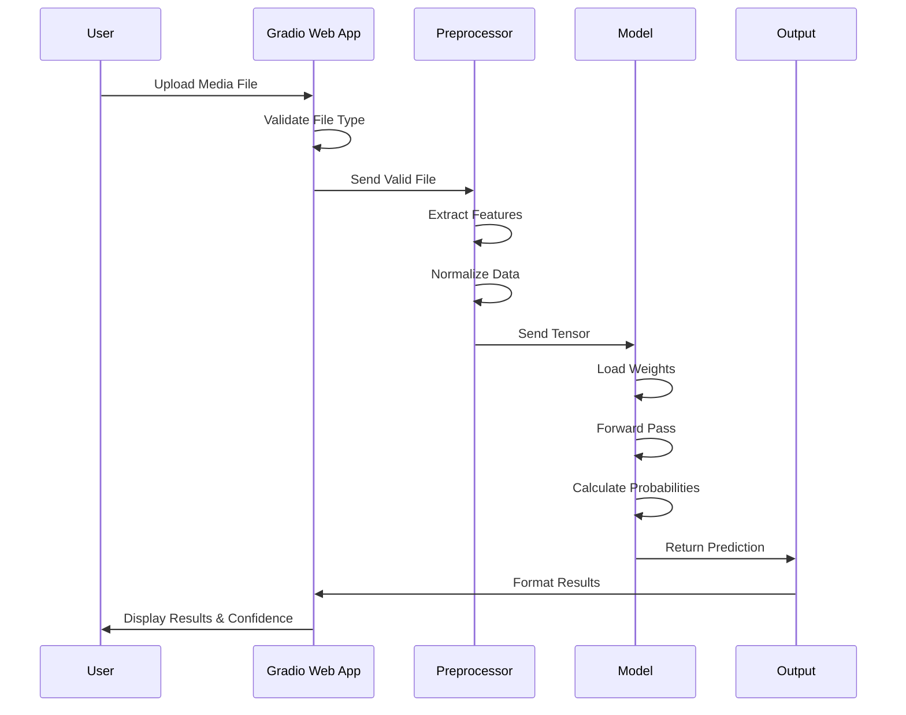
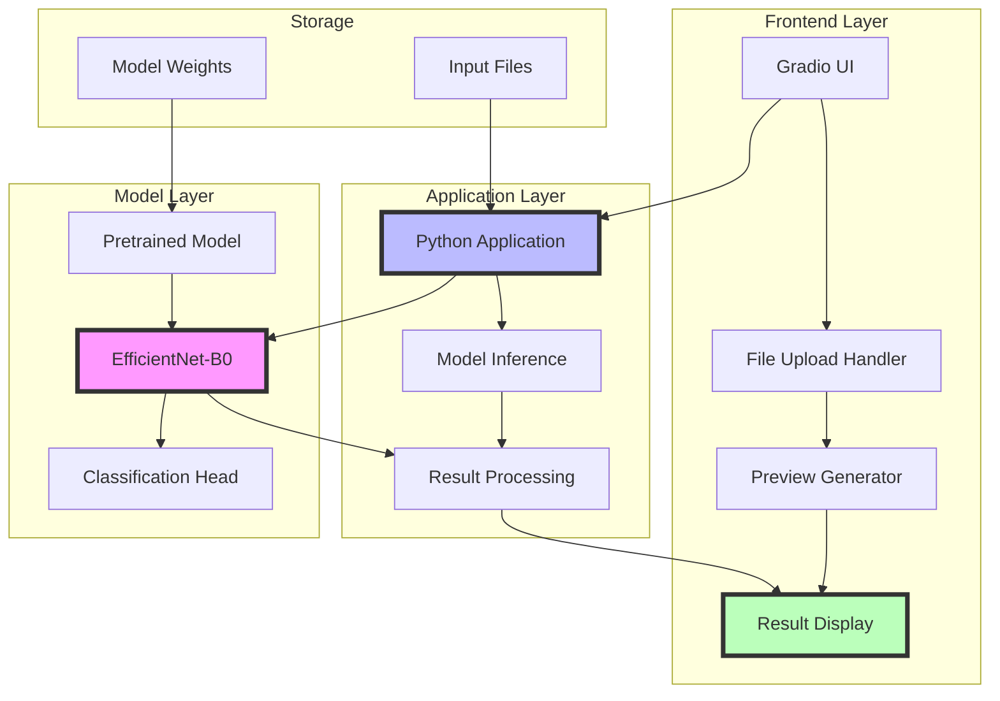
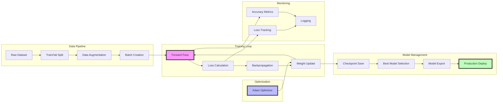

# Deepfake Detection System Architecture

## Detailed Component Architecture

## Data Flow Architecture

## System Component Interaction

## Deployment Architecture (Current)

## Model Training Architecture

## Architecture Summary

This updated architecture now accurately reflects the current Deepfake Detection System implementation:

**Core Components (Implemented ✓):**
- **Data Input & Preprocessing:** Image/video loading with 224x224 resize and normalization
- **Feature Extraction:** EfficientNet-B0 backbone with ImageNet weights
- **Classification Head:** Dropout (0.4) + Linear layer (1280→2) + Softmax
- **Training Pipeline:** PyTorch Lightning with Adam optimizer, early stopping, checkpointing
- **Inference Pipeline:** Model loading, forward pass, probability conversion
- **Video Processing:** Frame extraction and probability aggregation
- **Web Interface:** Gradio-based UI for file upload and results display
- **Model Management:** Checkpoint saving and best model selection

**Simplified Components:**
- Single model (ensemble system removed)
- Direct probability averaging for videos
- Local storage with file handling
- No external database, task queue, or advanced monitoring infrastructure

